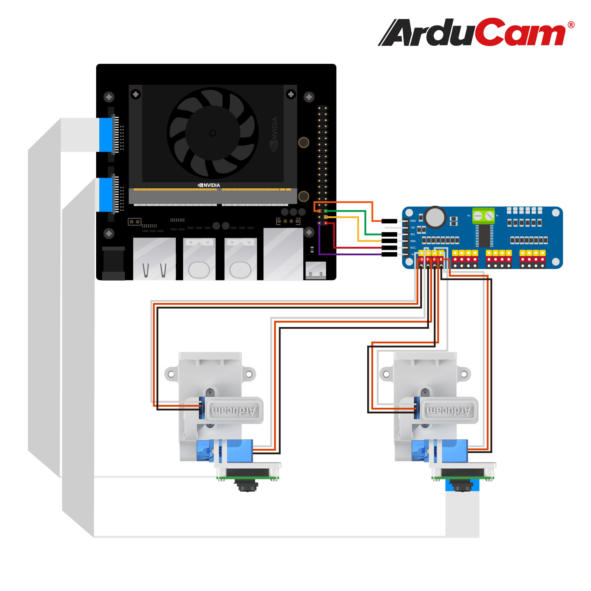
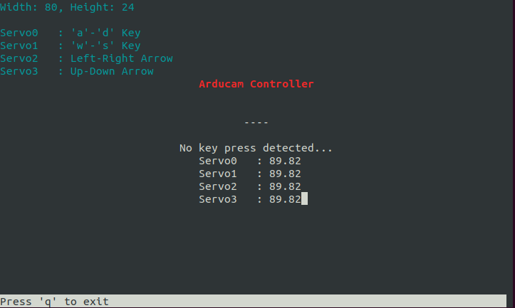

## Installation dependencies

```
    sudo apt update
    sudo apt install python3-pip
    sudo pip3 install adafruit-circuitpython-servokit
```

## Wiring diagram


## ServoKitExample
`python3 ServoKitExample.py`  

  

## Related Links
For more tutorials, please check: [JETSON XAVIER NX LESSON](https://toptechboy.com/category/jetson-xavier-nx/)